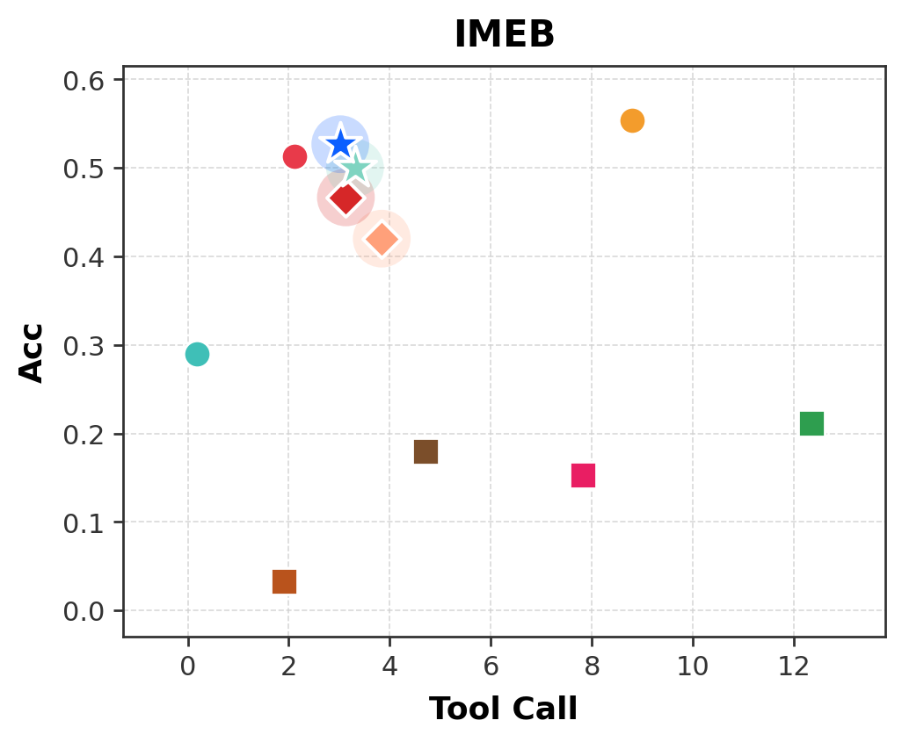
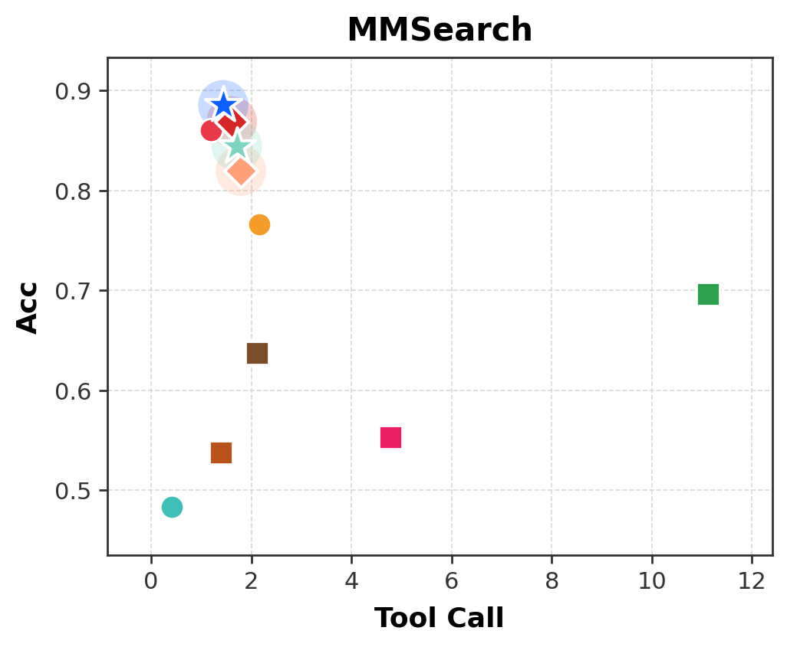
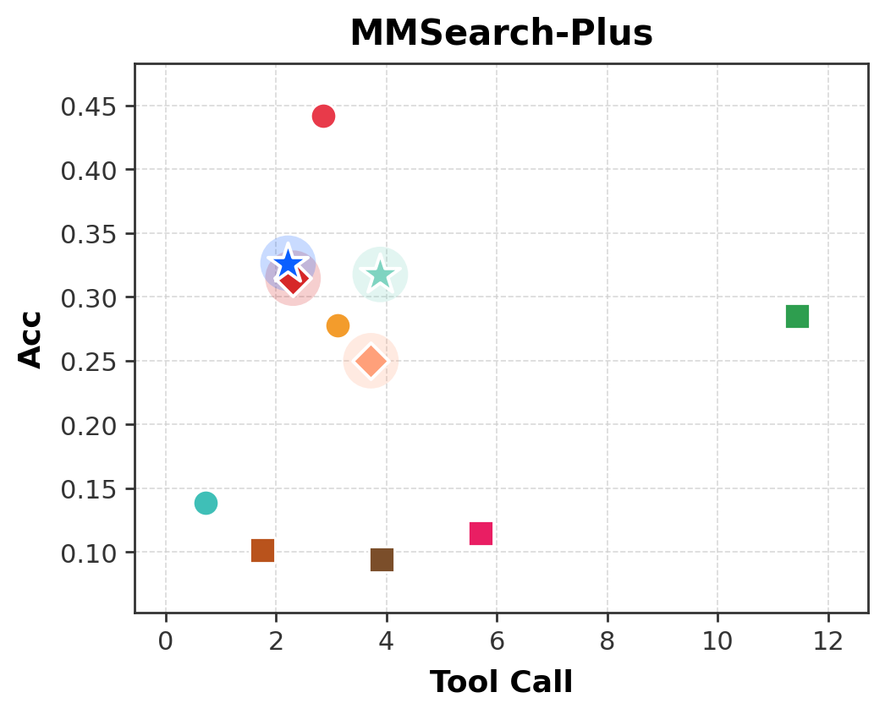
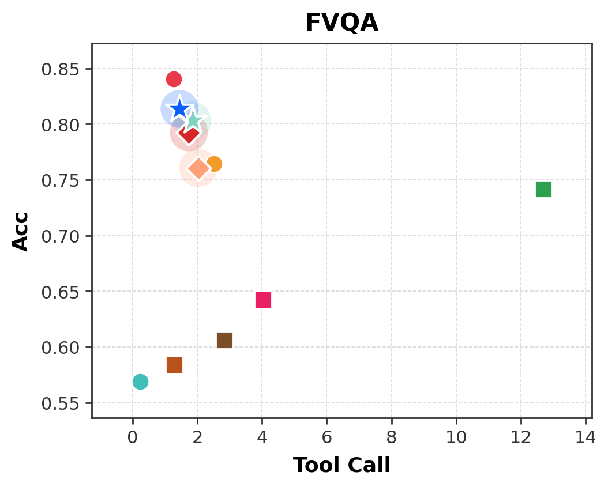
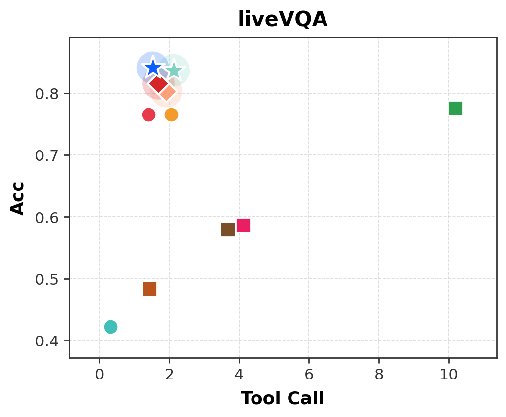
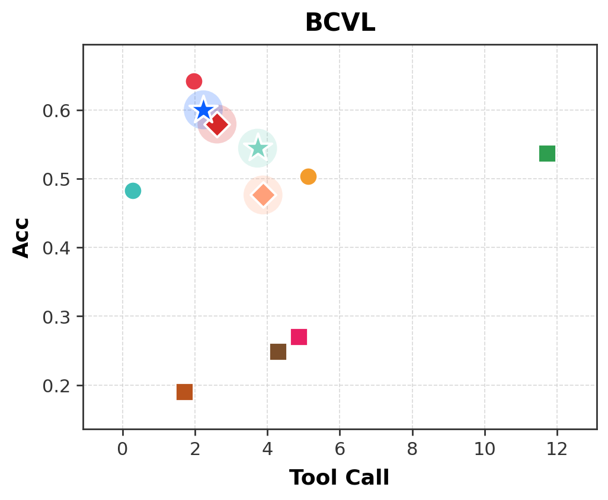
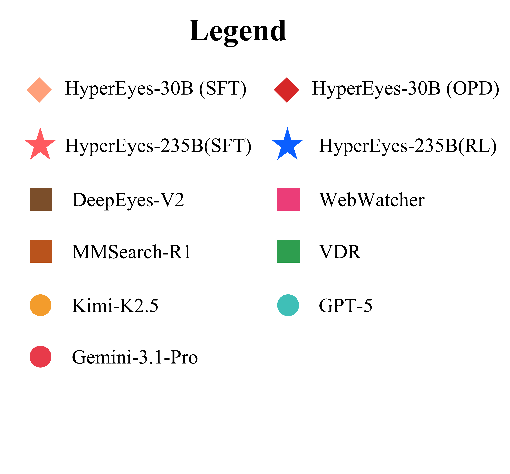

# HyperEyes

**HyperEyes: Dual-Grained Efficiency-Aware Reinforcement Learning for Parallel Multimodal Search Agents**

> *Search wider, not longer.*

HyperEyes is a **parallel multimodal search agent** that fuses visual grounding and retrieval into a single atomic action, enabling concurrent search across multiple entities while treating inference efficiency as a first-class training objective.

<p align="center">
  
</p>

---

## 🔥 Highlights

- **Parallel Multimodal Search Agent.** A new agent paradigm operating on a **Unified Grounded Search (UGS)** action space that fuses visual grounding and retrieval into one atomic action, extending text-level parallelism to the visual modality.
- **Dual-Grained Efficiency-Aware RL Framework.**
  - **Macro-level — TRACE** (Tool-use Reference-Adaptive Cost Efficiency): a trajectory-level reward whose reference is *monotonically tightened* during training to suppress superfluous tool calls without over-restricting genuine multi-hop search.
  - **Micro-level — On-Policy Distillation (OPD):** dense token-level corrective signals from an external teacher on failed rollouts, mitigating credit-assignment deficiency of sparse outcome rewards.
- **Parallel-Amenable Data Synthesis Pipeline.** Covers visual multi-entity and textual multi-constraint queries, with **Progressive Rejection Sampling** to curate efficiency-oriented cold-start trajectories.
- **IMEB Benchmark.** A human-curated **Image Multi-Entity Benchmark** (300 instances) that jointly evaluates multimodal search **accuracy and efficiency** — the first benchmark to make operational efficiency a first-class metric in multi-entity visual scenarios.
- **State-of-the-art Performance.** Across six benchmarks, **HyperEyes-30B** surpasses the strongest open-source multimodal search agent of comparable scale by **+9.9% accuracy** with **5.3× fewer** tool-call rounds on average.

---

## 📖 Motivation

The parametric knowledge of (M)LLMs is constrained by their training cutoff, motivating **search agents** that ground responses in real-time, verifiable information. Yet the prevailing paradigm of multimodal search agents relies heavily on **sequential** tool invocations to deepen the reasoning chain, incurring severe interaction redundancy when queries naturally decompose into independent sub-retrievals.

While parallel tool invocation has emerged in text-based agents, *possessing parallel capability does not guarantee efficient search behavior.* When models are optimized purely by accuracy reward, they lack the incentive to prefer compact parallel trajectories over verbose ones — parallelism degrades into brute-force over-searching.

HyperEyes addresses this with the principle of **"search wider, not longer"**: dispatching multiple grounded queries concurrently within a round, rather than chaining them sequentially.

<p align="center">
  
  
  
  
</p>

---

## 🧠 Method Overview

HyperEyes is trained in two stages on top of the **UGS** action space:

1. **Cold-start (SFT) via Parallel-Amenable Data Synthesis.**
   - Synthesize visual multi-entity & textual multi-constraint queries.
   - Apply *Progressive Rejection Sampling* to harvest efficiency-oriented trajectories.

2. **Dual-Grained Efficiency-Aware Reinforcement Learning.**
   - **TRACE (macro):** trajectory-level efficiency reward with monotonically tightening reference, dynamically guiding the policy toward minimum-cost successful trajectories.
   - **OPD (micro):** on-policy distillation from an expert teacher on *failed* rollouts, providing dense per-token corrective supervision under sparse outcome rewards.

This dual-grained signal jointly addresses (a) trajectory-level over-searching and (b) token-level credit assignment, producing a policy that is both **wider** in parallel breadth and **shorter** in interaction depth.

---

## 📊 IMEB Benchmark

Standard evaluations primarily assess final-answer accuracy, masking the inefficiencies of verbose search trajectories. We introduce **IMEB (Image Multi-Entity Benchmark)** — a human-curated benchmark of **300 multi-entity visual instances** that jointly evaluates:

- **Answer accuracy**
- **Search efficiency** (tool-call rounds, parallel breadth)

Each instance features a multi-entity image paired with a question that **strictly requires concurrent localization and retrieval** across multiple entities, exposing parallel search breadth as the primary bottleneck in multi-entity visual search.

---

## 📈 Main Results

Across six benchmarks (including MMSearch, MMSearch-Plus, FVQA, LiveVQA, BCVL, and IMEB):

| Metric | HyperEyes-30B vs. strongest open-source baseline |
| :--- | :--- |
| Accuracy | **+9.9%** |
| Avg. tool-call rounds | **5.3× fewer** |

HyperEyes **Pareto-dominates** existing multimodal search agents on the joint accuracy–efficiency frontier.

<p align="center">
  
  
</p>

---

## 📁 Repository Structure

```
HyperEyes/
├── README.md
└── figures/                       # Paper figures
    ├── Teaser.pdf                 # Conventional vs. HyperEyes (motivation)
    ├── framework.pdf              # Overall HyperEyes framework
    ├── parallel_vs_serial.pdf     # Parallel vs. serial search comparison
    ├── search_paradigms.pdf       # Search paradigm taxonomy
    ├── shuffle_robustness.pdf     # Shuffle-order robustness study
    ├── IMEB.pdf                   # IMEB benchmark overview
    └── sub_fig/                   # Per-benchmark result subfigures
        ├── IMEB.png
        ├── MMSearch.png
        ├── MMSearch-Plus.png
        ├── FVQA.png
        ├── liveVQA.png
        ├── BCVL.png
        └── legend.png
```

> 📌 **Note.** This repository currently hosts the project page and figures. **Code, model checkpoints, and the IMEB benchmark will be released soon.** Please ⭐ star and watch the repo for updates.

---

## 🗺️ Roadmap

- [x] Paper figures and project page
- [ ] IMEB benchmark release (data + evaluation scripts)
- [ ] Parallel-Amenable Data Synthesis pipeline
- [ ] Cold-start (SFT) training code
- [ ] Dual-Grained Efficiency-Aware RL training code (TRACE + OPD)
- [ ] HyperEyes-30B model weights
- [ ] Inference / demo scripts

---

## 📜 Citation

If you find HyperEyes useful for your research, please consider citing:

```bibtex
@article{hypereyes2026,
  title  = {HyperEyes: Dual-Grained Efficiency-Aware Reinforcement Learning for Parallel Multimodal Search Agents},
  author = {Anonymous},
  year   = {2026},
  note   = {Under review}
}
```

---

## 📬 Contact

For questions, suggestions, or collaboration, please open an issue in this repository.

---

## 📄 License

Code and benchmark will be released under a permissive open-source license (TBD). Figures are released for academic use.
