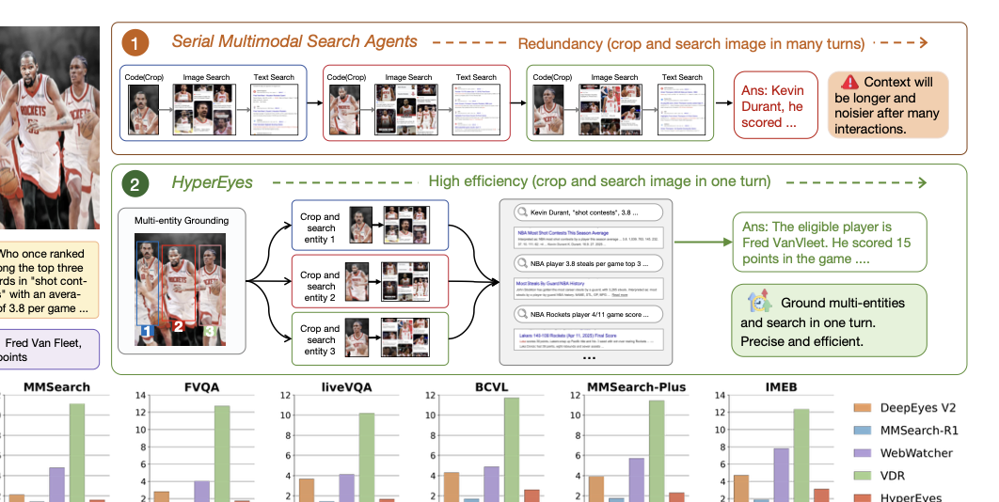
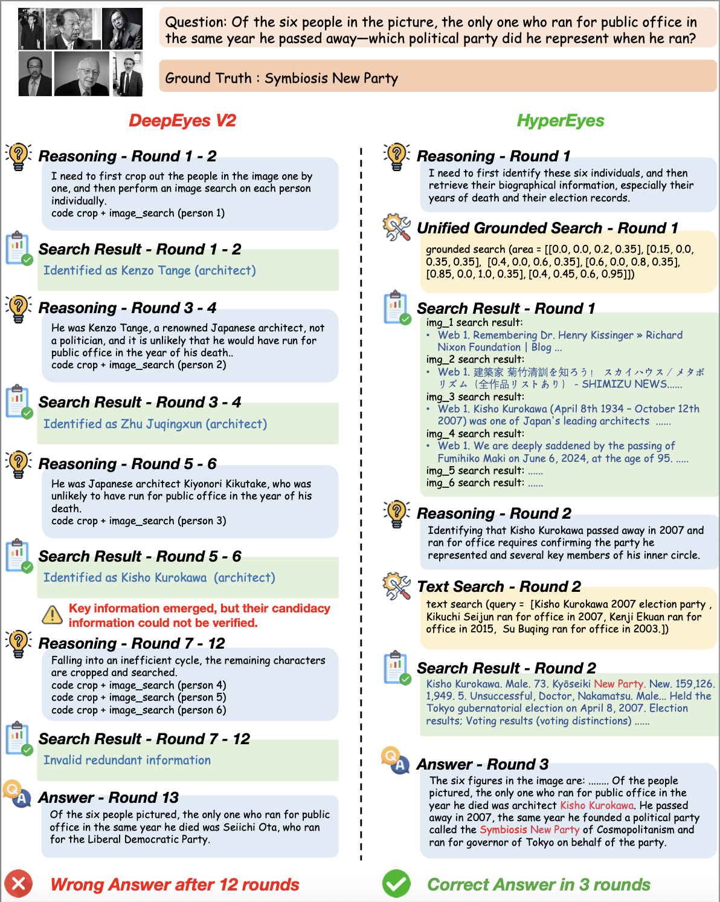
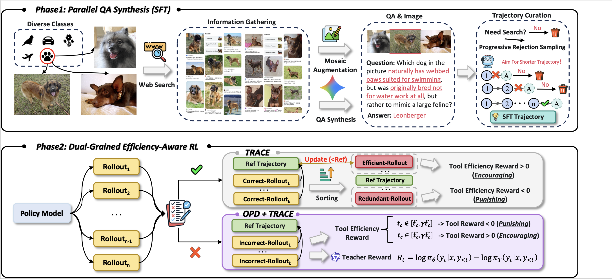
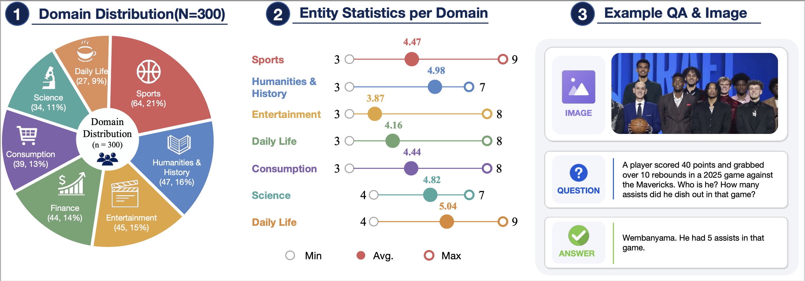
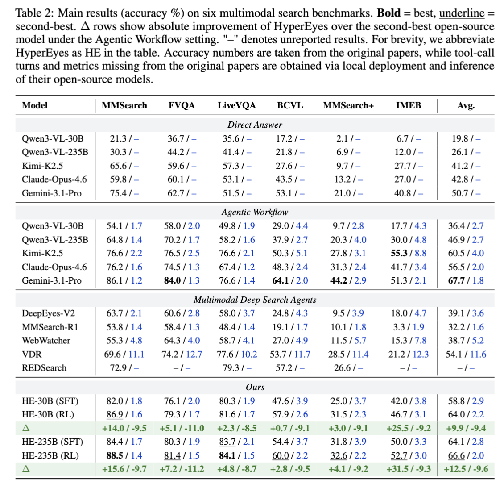

# HyperEyes

**HyperEyes: Dual-Grained Efficiency-Aware Reinforcement Learning for Parallel Multimodal Search Agents**

> *Search wider, not longer.*

HyperEyes is a **parallel multimodal search agent** that fuses visual grounding and retrieval into a single atomic action, enabling concurrent search across multiple entities while treating inference efficiency as a first-class training objective.

<p align="center">
  
</p>

<p align="center"><i>Comparison between conventional multimodal search agents and HyperEyes. While conventional agents suffer from redundant interaction rounds to process multiple entities, HyperEyes achieves high efficiency by grounding and searching multiple entities concurrently in a single turn.</i></p>

---

## 🔥 Highlights

- **Parallel Multimodal Search Agent.** A new agent paradigm operating on a **Unified Grounded Search (UGS)** action space that fuses visual grounding and retrieval into one atomic action, extending text-level parallelism to the visual modality.
- **Dual-Grained Efficiency-Aware RL Framework.**
  - **Macro-level — TRACE** (Tool-use Reference-Adaptive Cost Efficiency): a trajectory-level reward whose reference is *monotonically tightened* during training to suppress superfluous tool calls without over-restricting genuine multi-hop search.
  - **Micro-level — On-Policy Distillation (OPD):** dense token-level corrective signals from an external teacher on failed rollouts, mitigating credit-assignment deficiency of sparse outcome rewards.
- **Parallel-Amenable Data Synthesis Pipeline.** Covers visual multi-entity and textual multi-constraint queries, with **Progressive Rejection Sampling** to curate efficiency-oriented cold-start trajectories.
- **IMEB Benchmark.** A human-curated **Image Multi-Entity Benchmark** (300 instances) that jointly evaluates multimodal search **accuracy and efficiency** — the first benchmark to make operational efficiency a first-class metric in multi-entity visual scenarios.
- **State-of-the-art Performance.** Across six benchmarks, **HyperEyes-30B** surpasses the strongest open-source multimodal search agent of comparable scale by **+9.9% accuracy** with **5.3× fewer** tool-call rounds on average.

---

## 📖 Motivation

The parametric knowledge of (M)LLMs is constrained by their training cutoff, motivating **search agents** that ground responses in real-time, verifiable information. Yet the prevailing paradigm of multimodal search agents relies heavily on **sequential** tool invocations to deepen the reasoning chain, incurring severe interaction redundancy when queries naturally decompose into independent sub-retrievals.

While parallel tool invocation has emerged in text-based agents, *possessing parallel capability does not guarantee efficient search behavior.* When models are optimized purely by accuracy reward, they lack the incentive to prefer compact parallel trajectories over verbose ones — parallelism degrades into brute-force over-searching.

HyperEyes addresses this with the principle of **"search wider, not longer"**: dispatching multiple grounded queries concurrently within a round, rather than chaining them sequentially.

<p align="center">
  
</p>

<p align="center"><i>Parallel multimodal search vs. conventional serial search: HyperEyes dispatches multiple grounded queries concurrently within a single round, drastically reducing interaction rounds and end-to-end latency.</i></p>

---

## 🧠 Method Overview

<p align="center">
  
</p>

<p align="center"><i>Overview of the HyperEyes framework: a Unified Grounded Search (UGS) action space combined with a two-stage training recipe — Parallel-Amenable Data Synthesis for cold-start SFT, followed by Dual-Grained Efficiency-Aware RL with TRACE (trajectory-level) and OPD (token-level) supervision.</i></p>

HyperEyes is trained in two stages on top of the **UGS** action space:

1. **Cold-start (SFT) via Parallel-Amenable Data Synthesis.**
   - Synthesize visual multi-entity & textual multi-constraint queries.
   - Apply *Progressive Rejection Sampling* to harvest efficiency-oriented trajectories.

2. **Dual-Grained Efficiency-Aware Reinforcement Learning.**
   - **TRACE (macro):** trajectory-level efficiency reward with monotonically tightening reference, dynamically guiding the policy toward minimum-cost successful trajectories.
   - **OPD (micro):** on-policy distillation from an expert teacher on *failed* rollouts, providing dense per-token corrective supervision under sparse outcome rewards.

This dual-grained signal jointly addresses (a) trajectory-level over-searching and (b) token-level credit assignment, producing a policy that is both **wider** in parallel breadth and **shorter** in interaction depth.

---

## 📊 IMEB Benchmark

Existing multimodal search benchmarks evaluate reasoning accuracy while neglecting tool-call efficiency, allowing models to resolve parallelizable queries via verbose sequential trajectories that inflate latency and introduce noisy retrievals. To close this gap, we introduce the **Image Multi-Entity Benchmark (IMEB)**, which elevates **search efficiency to a primary evaluation axis** and constructs queries that *strictly* require concurrent localization and retrieval across multiple entities.

**Dataset.** Curated by **PhD-level annotators** through multiple rounds of **double-blind cross-validation**, IMEB comprises **300 rigorously verified instances** across **6 diverse domains** (Sports, Humanities & History, Entertainment, Daily Life, Consumption, Science, Finance), with an average of **4.6 entities per image**. Every question undergoes rigorous human peer-review and automated filtering to guarantee that it is unambiguously solvable yet strictly necessitates concurrent external tool invocation.

<p align="center">
  
</p>

<p align="center"><i>Overview of the IMEB benchmark: domain distribution (N = 300), entity-count statistics for each domain, and an example question-answer pair.</i></p>

### Cost-Aware Score (CAS)

Since traditional accuracy metrics alone cannot capture parallel operational efficiency, we propose a unified metric that jointly quantifies reasoning correctness and search efficiency:

$$
\mathrm{CAS} = \frac{\mathrm{Acc}^{2} \times 100}{N_{\text{tok}} + 2 N_{\text{tool}} + 1}
$$

- **Numerator — Acc² × 100.** The squared accuracy term ensures that *correctness remains the primary optimization objective*; small accuracy gaps are amplified to prevent trivially "fast but wrong" agents from scoring high.
- **Denominator — token & tool cost.** Penalizes token consumption ($N_{\text{tok}}$, in thousands) and sequential tool-call rounds ($N_{\text{tool}}$). The weights `(1, 2)` approximate a one-second latency overhead for both generation and tool execution.
- **Net effect.** CAS facilitates **fair comparison across distinct agent architectures** by jointly rewarding accuracy and operational efficiency on a single axis.

---

## 📈 Main Results

<p align="center">
  
</p>

<p align="center"><i>Main results (accuracy % / tool-call turns) on six multimodal search benchmarks. <b>Bold</b> = best, underline = second-best. Δ rows show absolute improvement of HyperEyes (HE) over the second-best open-source model under the Agentic Workflow setting.</i></p>

> **Takeaway.** HyperEyes **Pareto-dominates** existing multimodal search agents on the joint accuracy–efficiency frontier: HE-30B (RL) surpasses the strongest open-source agent by **+9.9% accuracy** and reduces tool-call turns by **9.4** on average; HE-235B (RL) further closes the gap to / outperforms top closed-source models such as Gemini-3.1-Pro on multiple benchmarks while remaining substantially more efficient than existing deep search agents.

---

## 🗺️ Roadmap

- [x] Paper figures and project page
- [ ] IMEB benchmark release (data + evaluation scripts)
- [ ] Parallel-Amenable Data Synthesis pipeline
- [ ] Cold-start (SFT) training code
- [ ] Dual-Grained Efficiency-Aware RL training code (TRACE + OPD)
- [ ] HyperEyes-30B / 235B model weights
- [ ] Inference / demo scripts

> 📌 **Note.** Code, model checkpoints, and the IMEB benchmark will be released soon. Please ⭐ star and watch the repo for updates.

---

## ⭐ Star History

<p align="center">
  <a href="https://star-history.com/#DeepExperience/HyperEyes&Date">
    
  </a>
</p>

---

## 📜 Citation

If you find HyperEyes useful for your research, please consider citing:

```bibtex
@article{li2026hypereyes,
  title   = {HyperEyes: Dual-Grained Efficiency-Aware Reinforcement Learning for Parallel Multimodal Search Agents},
  author  = {Li, Guankai and Chen, Jiabin and Xu, Yi and Zhang, Xichen and Lu, Yuan},
  journal = {arXiv preprint},
  year    = {2026},
  note    = {Preprint},
  url     = {https://github.com/DeepExperience/HyperEyes}
}
```

<!-- ---

## 📬 Contact

For questions, suggestions, or collaboration, please open an issue in this repository, or reach out via email:

- **Yuan Lu** (corresponding author) — [`luyuan2@xiaohongshu.com`](mailto:luyuan2@xiaohongshu.com)
- **Guankai Li** — [`liguankai@xiaohongshu.com`](mailto:liguankai@xiaohongshu.com)

--- -->

<!-- ## 📄 License

Code and benchmark will be released under a permissive open-source license (TBD). Figures are released for academic use. -->
